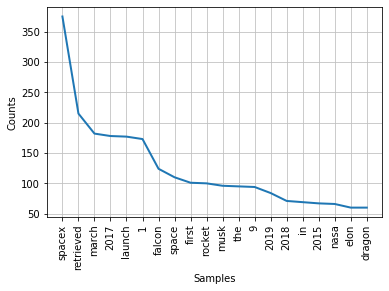

# NLTK Example Script

Import the following python libraries

```python
import nltk
import urllib.request
from nltk.corpus import stopwords
from nltk.tokenize import word_tokenize
from bs4 import BeautifulSoup
import matplotlib.pyplot as plt


# This will download the stopwords list
nltk.download('stopwords')
```

Use urllib.request library to get the html from the url of choice

```python
url = 'https://en.wikipedia.org/wiki/SpaceX'
response = urllib.request.urlopen(url)
html = response.read()
# print(html) // helpful to see if you got anything 
```

Use BeautifulSoup library to make the soup

```python
soup = BeautifulSoup(html, 'html.parser')
#print(soup.prettify()) // prints pretty soup
txt = soup.get_text()
```

Use the NLTK library to convert the "txt" from above into tokens and to strip out all of the useless articles, prepositions and other less import words.

```python
stop_words = set(stopwords.words('english'))
word_tokens = word_tokenize(txt)
filtered_sentence = [w for w in word_tokens if not w in stop_words]
filtered_sentence = [w.lower() for w in filtered_sentence if w.isalnum()]
```

I used a list compression to convert all of the tokenized words to lowercase and to strip out anything that is not alpha or numeric. 

```python
# In other words, list compressions are cool.
[w.lower() for w in txt if w.isalnum()]
```

Now using the nltk.FreqDist library we get the frequency each word is used. 

```python
freq = nltk.FreqDist(filtered_sentence)
```

Finally I use the matplotlib library to display a cool graph of the first 20 most frequent words found.

```python
fig = plt.figure()
plt.gcf().subplots_adjust(bottom=0.15) # to avoid x-ticks cut-off
freq = nltk.FreqDist(filtered_sentence)
freq.plot(20, cumulative=False)

# Use these lines to print the chart
# plt.show()
# fig.savefig('freqDist.png', bbox_inches = "tight")
```

 
 
 


